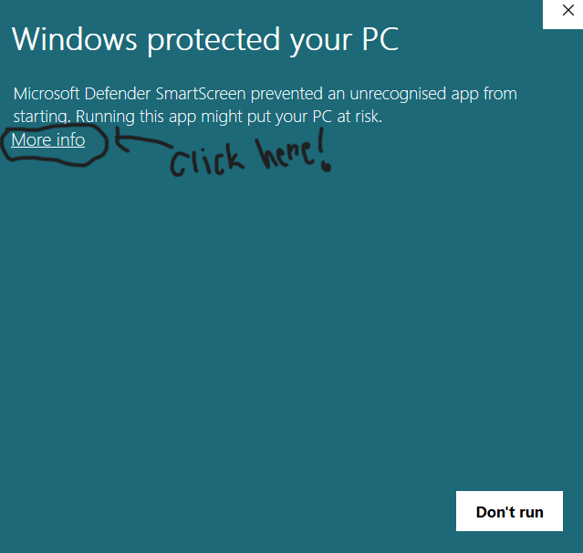
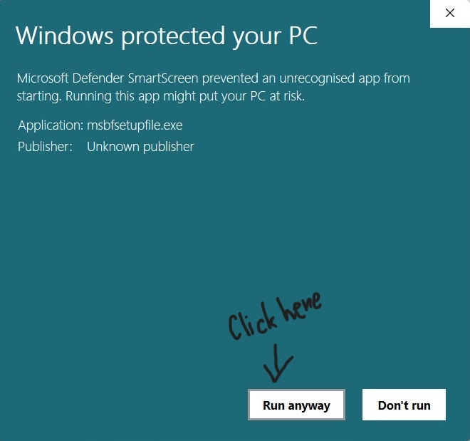
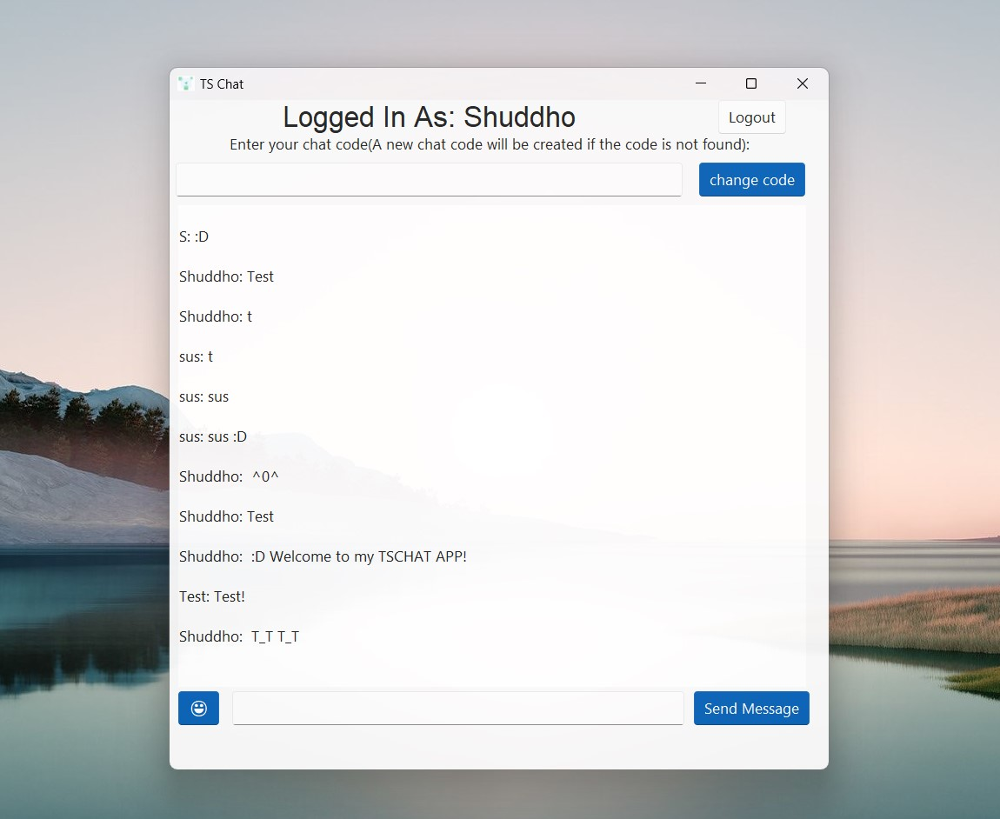

# TS CHAT, A Chatting Application
> TS Chat, an alternative for messenger, enables low end pc users to enjoy the features to communicate with others more securely in a texting way.
 

# Why TS CHAT?
> TS Chat enables you to chat with others using a low end pc and moreover as it is made for low end pc's the cpu usage is very low and ram usage is under 30MB! If you use mid level cpu's like `i5-1035g1` your cpu usage will be under 5% for sure! If you don't believe then try it by yourself 😉...

# How to download and install

> `Step:1` First download the exe file in your windows pc from [Here](https://github.com/Shuddho11288/TSCHAT/raw/main/msbfsetupfile.exe)
 

> `Step:2` Open the file . If you face security issues then follow the images given below:- 

>`Step:3` Now hopefully the installation window has been opened! Now just install it normally just like other apps you have done in windows operating system!

 

# How to use it?

> Using it is very simple! When you run this app for the first time you will be given a window for login! Just put your name and you don't need to put any password. `(Just for show for now but we are planning to implement a secured login system in future)!`

> After clicking the login button, you can finally use the app to chat. Initially your chat room will be set to global. Chat room is similar to messenger groups , you just need to create it and share with whom you want to talk! A preview image is given below:- 

 

## Thank you for using our app 😀!
